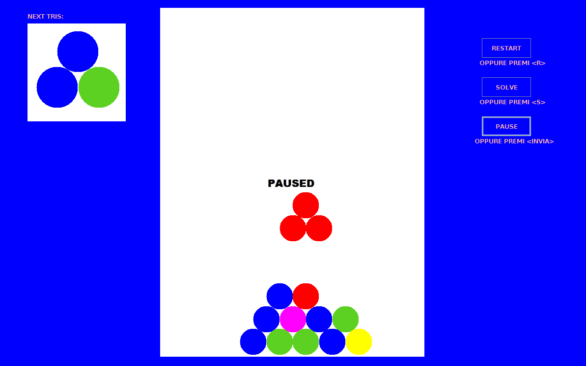

# PileOfBalls
Crea tonnellate di divertimento rotante mentre carichi nelle affascinanti e colorate pile di palle! 
Il tuo obiettivo in questo gioco è formare gruppi di almeno 4 palline dello stesso colore in modo che possano essere rimossi. 
Se il gioco si fa duro premi "solve" e l'intelligenza artificiale ti suggerirà le successive mosse.

## Screen
 

## Built With

* [Java 5](https://www.inf.unibz.it/~calvanese/teaching/java-docs/5.0/api/ "Java 5") 
* [Eclipse Juno](https://www.eclipse.org/downloads/packages/release/juno)
* [JDLV](https://www.mat.unical.it/informatica/IntelligenzaArtificiale)

## Contributing

Davide Aloia - https://github.com/playa92

## Guide

How to integrate jdlv and configure Eclipse?
<a href="https://drive.google.com/open?id=1E7Hwpy8YsWPms7uk03D1b6DsNPVEW6jj">Configuration</a>.
